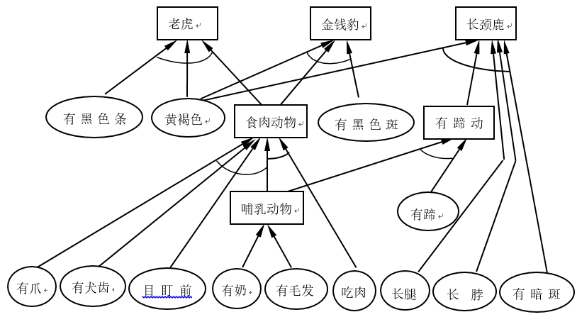
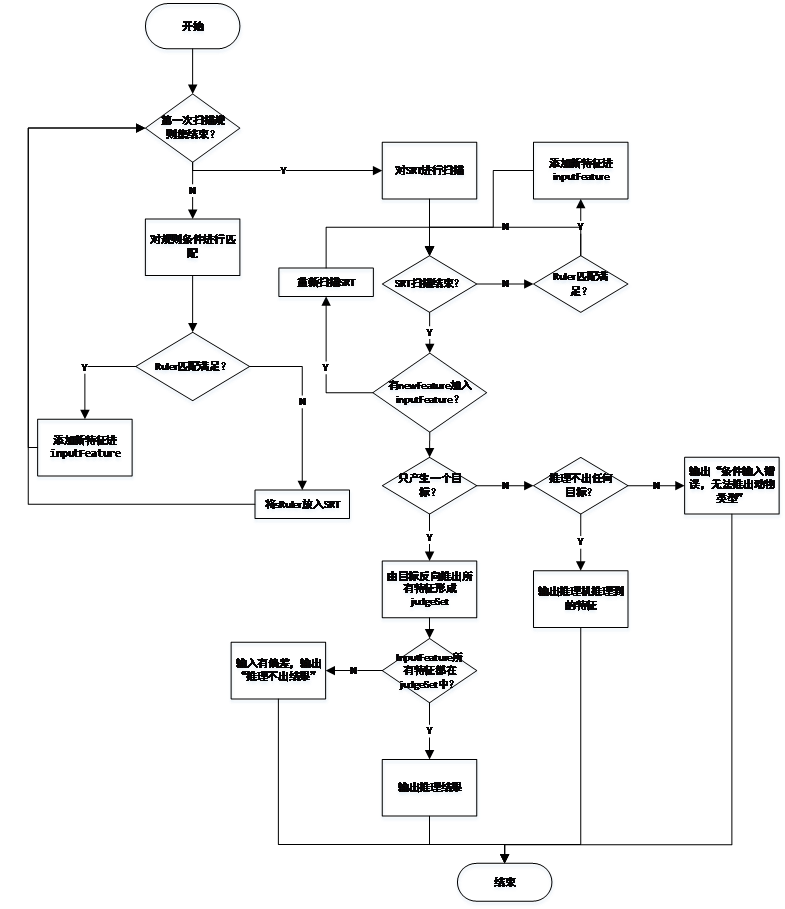

## Enviroment

* 硬件环境：微型计算机

* 软件环境：Windows10 操作系统，Eclipse编译工具

* 编程语言：Java (JDK1.8)

## 实验原理

### 动物识别系统概述

动物识别系统是以产生式系统为基础设计的。产生式系统是建立在因果关系的基础上的，因此，可以很容易地描述事实、规则及其不确定性度量。当输入的特征足够判断某种动物时，动物识别系统会输出满足特征的动物，当不满足时，动物识别系统会推理出，由输入的特征，可以得知推出的动物可能具有什么特征。

### 规则的表述

产生式一般形式为：前件->后件。例如：

<center> 有毛发 -> 哺乳动物</center>

<center> 会飞+生蛋 –> 鸟</center>

产生式规则的语言含义是：如果前件满足，则可得到houjian2的结论或者执行后件的相应动作，这些都由前件来触发。而在产生式系统中，一个产生式生成的结论可以作为另一个产生式的前提或语言变量使用，进一步可构成产生式系统。


###	产生式系统的推理
产生式系统的推理有正向推理、反向推理和双向推理。在这个动物识别系统中，我们将使用正向推理，来得出最后的结果。然后用结果进行反向推理，得出求出这个结果的所有特征，从而对输入的特征进行验证，判断是否输入的规则是否全部满足得出的结果。比如：

<center>有黑色条纹 + 黄褐色 + 食肉动物 -> 老虎

有黑色条纹 + 黄褐色 + 食肉动物 + 会飞 –> NULL

（产生结果老虎，但验证失败，不会输出动物类型）
有黑色条纹 + 黄褐色 –> FEATURE

（条件不足，无法产生结果，但会知道该动物特征是“有黑色条纹”和“黄褐色”）
</center>

这个就是我们系统所做的。

## 设计实现
### 规则集
* 若某动物有奶，则它是哺乳动物。
* 若某动物有毛发，则它是哺乳动物。
* 若某动物有羽毛，则它是鸟。
* 若某动物会飞且生蛋，则它是鸟。
* 若某动物是哺乳动物且有爪且有犬齿且目盯前方，则它是食肉动物。
* 若某动物是哺乳动物且吃肉，则它是食肉动物。
* 若某动物是哺乳动物且有蹄，则它是有蹄动物。
* 若某动物是哺乳动物且反刍食物，则它是有蹄动物。
* 若某动物是食肉动物且黄褐色且有黑色条纹，则它是老虎。
* 若某动物是食肉动物且黄褐色且有黑色斑点，则它是金钱豹。
* 若某动物是有蹄动物且长腿且长脖子且黄褐色且有暗斑点，则它是长颈鹿。
* 若某动物是有蹄动物且白色且有黑色条纹，则它是斑马。
* 若某动物是鸟且不会飞且长腿且长脖子且黑白色，则它是驼鸟。
* 若某动物是鸟且不会飞且会游泳且黑白色，则它是企鹅。
* 若某动物是鸟且善飞，则它是海燕。

### 规则集图

### AISalgorithm流程图

### AISalgorithm主要代码
#### main algorithm
```
// the first loop, find the satisfy ruler
		for(SingelRuler sRuler : deductionRules.rulerSet) {
			if(deductionRules.satisfySingelRuler(sRuler, inputFeature)==true) {
				inputFeature.addDeductionFeature(sRuler.newFeature);
			}
			else {
				srt.addSRT(sRuler);
				srt.ChangeFlag = true;
			}
		}
		// the second loop, end when the changeflag = false
		while(srt.ChangeFlag==true) {
			srt.ChangeFlag = false;
			for(SingelRuler sRuler : srt.rulerSet) {
				if(srt.satisfySingelRuler(sRuler, inputFeature)==true) {
					inputFeature.addDeductionFeature(sRuler.newFeature);
					srt.ChangeFlag = true;
				}
			}
			if(srt.ChangeFlag==false)break;
		}

		// System.out.println(inputFeature.getAGoal());
		if(inputFeature.getAGoal()==true) {
			Feature goal = inputFeature.goal(fSets);
			if(goal!=null) {
				int goalID = goal.featureID;
				if(inputFeature.allFeatureSatisfy(inputFeature , judgeSet , deductionRules , goalID)==true) {
					System.out.println("此次推理出的动物是："+goal.feature);
				}else {
					System.out.println("条件输入错误，无法判断动物类型");
				}
			}
		}else if(inputFeature.getNullGoal()==true) {
			// can not get a goal, so we find its feature
			System.out.println("条件不足，无法推出动物类型");
			InputFeature noUsedFeature = new InputFeature(inputFeature.lengthOfFeature);
			noUsedFeature.findNoUsedFeature( inputFeature , noUsedFeature );
			if(noUsedFeature.IF.isEmpty()==true)
				System.out.println("条件不足，无法推出动物类型");
			else {
				System.out.println("输入条件不足，但推理机已推出该动物有下列的特征：");
				for(Feature feature : noUsedFeature.IF) {
					System.out.print(fSets[feature.featureID].feature+" ");
				}
				System.out.println();
			}
		}else {
			// more than one animal
			System.out.println("条件输入错误，无法推出动物类型");
		}
		
		System.out.println("推理完成");
```
#### 添加结论所有特征
```
public void addDeductionFeature(int i) {
		Feature newFeature = new Feature();
		newFeature.isUsed = false;
		newFeature.featureID = i;
		if(i<lengthOfFeature) {
			newFeature.isGoal = false;
		}else {
			newFeature.isGoal = true;
		}
		if(isInArray(i)==false) {
			IF.add(newFeature);
		}
	}
```
#### 判断单特征是否满足规则
```
public boolean satisfySingelRuler(SingelRuler sRuler , InputFeature iFeature) {
		/* judge single ruler satisfy
		 * true: the ruler and the feature can get a new feature,
		 *  the feature that we used in this ruler set its isUsed to true
		 * false: the feature is not enough to get a new feature
		 * */
		boolean singleFeatureSatisfy = true;
		if(iFeature==null)
			return false;
		if(iFeature.IF.isEmpty()==true)
			return false;
		for (int i=0 ; i<sRuler.IFS.size() ; i++) {
			// for each ruler to get one of its new feature condition
			singleFeatureSatisfy = false;
			int featureID = sRuler.IFS.get(i);
			for(Feature feature : iFeature.IF) {
				// for each feature to judge
				if(feature.featureID == featureID) {
					singleFeatureSatisfy = true;
					break;
				}
			}
			if(singleFeatureSatisfy == false)
				// we judge in each loop
				// return false when a condition can not satisfy
				return false;
		}
		return true;
	}
```
#### 判断所有特征是否都满足
```
public boolean allFeatureSatisfy(InputFeature iF , InputFeature judgeSet , RulerSet rs , int goal) {
// 判断所有特征是否都满足
		if(iF==null)return false;
		boolean setNewFlag = true;
		judgeSet.addDeductionFeature(goal);
		while(setNewFlag==true) {
			// find the goal all the feature
			setNewFlag = false;
			for(SingelRuler sr : rs.rulerSet) {
				// for each ruler in rulerSet
				if(judgeSet.IF!=null) {
					for(int i=0 ; i<judgeSet.IF.size() ; i++) {
						// for each feature in judgeSet
						Feature feature = judgeSet.IF.get(i);
						if(feature.featureID == sr.newFeature) {
							for(int j=0 ; j<sr.IFS.size() ; j++) {
								// for the satisfied ruler , add its feature
								int featureID = sr.IFS.get(j);
								if(judgeContain(judgeSet, featureID)==false) {
									setNewFlag = true;
									judgeSet.addDeductionFeature(featureID);
								}
							}
						}
					}
				}
			}
			if(setNewFlag==false)break;
		}
		for(int i=0 ; i<iF.IF.size() ; i++) {
			Feature feature = iF.IF.get(i);
			if(feature.isUsed==true)
				continue;
			else {
				if(featureInJudgeSet(judgeSet, feature.featureID)==true)
					continue;
				else return false;
			}
		}
		return true;
	}
```
#### 判断特征是否在存储容器内
```
private boolean judgeContain(InputFeature judgeSet , int featureID) {
		for(int i=0 ; i<judgeSet.IF.size() ; i++) {
			Feature feature = judgeSet.IF.get(i);
			if(feature.featureID == featureID)
				return true;
		}
		return false;
	}
```